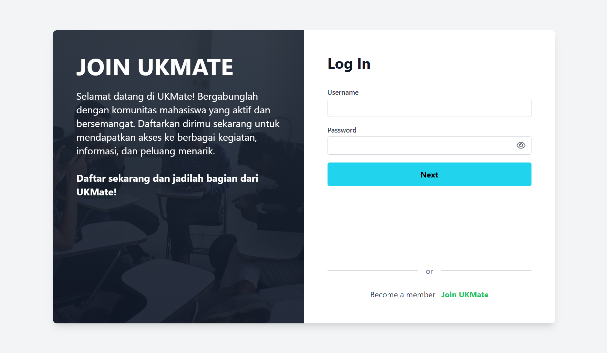
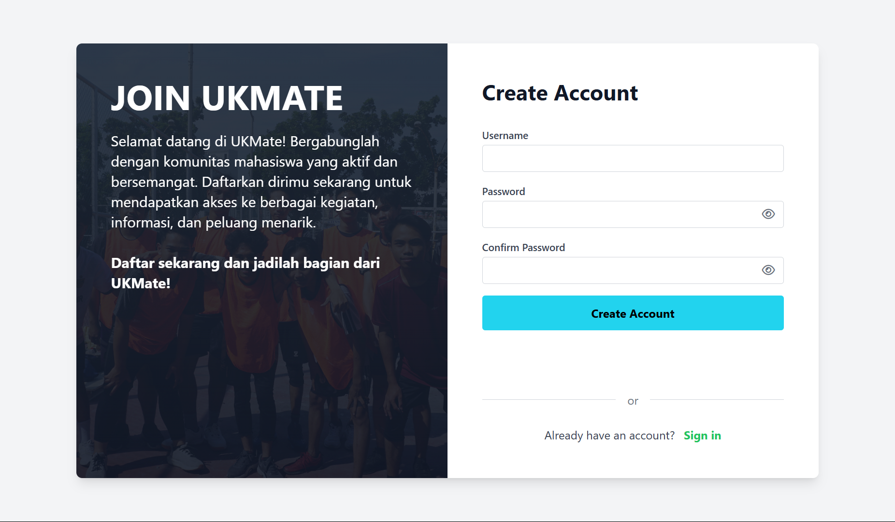
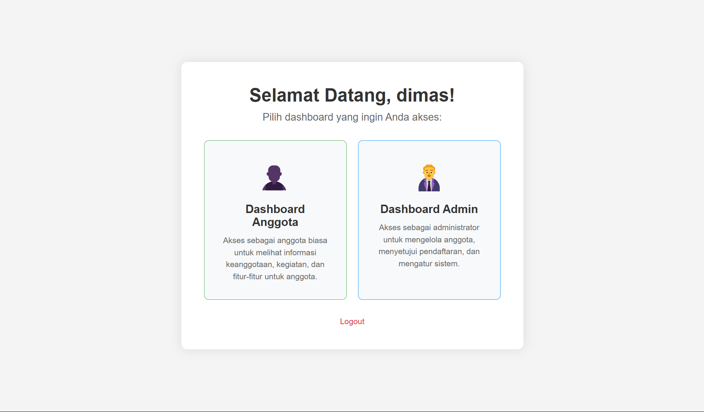

Project Description
- This project is a management information system web application for the Student Activity Unit (UKM) of the Faculty of Computer Science. This system is designed to facilitate the management of member data, activities, and organization administration in a digital and integrated manner.

📚 Academic Context
- Developed as the final exam project of the Web Programming course
- Apply the concept of full-stack web development with database integration
- Practical implementation of lecture material in real cases

💻 Tech Stack
- Frontend: HTML5, CSS3, JavaScript
- Backend: PHP (Server-side scripting)
- Database: MySQL/MariaDB
- Architecture: MVC (Model-View-Controller) pattern
- Responsive Design: Mobile-friendly interface

**UI/UX Display**

- **Login Page**

- **Register Page**

- **Login Choice**
